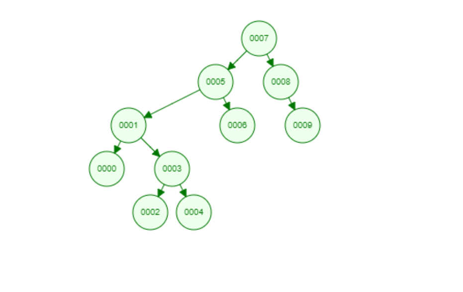

# Binary Search Tree Example

In computer science, a binary search tree (BST), also called an ordered or sorted binary tree, is a rooted binary tree data structure whose internal nodes each store a key greater than all the keys in the node's left subtree and less than those in its right subtree. The time complexity of operations on the binary search tree is directly proportional to the height of the tree.

Binary search trees allow binary search for fast lookup, addition, and removal of data items, and can be used to implement dynamic sets and lookup tables. Since the nodes in a BST are laid out in such a way that each comparison skips about half of the remaining tree, the lookup performance is proportional to that of binary logarithm.

The performance of a binary search tree is dependent on the order of insertion of the nodes into the tree; several variations of the binary search tree can be built with guaranteed worst-case performance. The basic operations include: search, traversal, insert and delete. BSTs with guaranteed worst-case complexities perform better than an unsorted array, which would require linear search time.

The complexity analysis of BST shows that, on average, the insert, delete and search takes O(logn) for n nodes. In the worst case, they degrade to that of a singly linked list: O(n).

## Algorithm

Binary Search Tree is a node-based binary tree data structure which has the following properties:

1. The left subtree of a node contains only nodes with keys lesser than the node’s key.
2. The right subtree of a node contains only nodes with keys greater than the node’s key.
3. The left and right subtree each must also be a binary search tree.

## Example

> [7,5,1,8,3,6,0,9,4,2]

## Solution

The result when we apply the algorithm steps is the photo you see below.

